[TOC]

# 作业2

## 第一题

（a）

​	传统的哈夫曼编码需要事先获得要编码的所有的字符的概率，并自底向上的构造哈夫曼树，为频率高的字符分配短编码。而自适应哈夫曼编码随着输入数据流的到达，动态地收集和更新符号的概率，然后符号会被赋予新的码字，这可以对不断变化的实时数据进行动态编码，弥补了哈夫曼编码的缺点。但由于单个丢失会损坏整个代码，因此它对传输错误更加敏感。

（b）

1. baNEWcc（bacc）

   最终的解码序列

   | 码字 | 01   | 01   | 00   | 10   | 101  |
   | :--- | :--- | :--- | ---- | ---- | ---- |
   | 信号 | b    | a    | NEW  | c    | c    |

   推导过程：

   1. 根据初始的哈夫曼树的解码序列为

   | 码字 | 1    | 01   | 10   | 11   | NEW  |
   | :--- | :--- | :--- | ---- | ---- | ---- |
   | 信号 | a    | b    | c    | d    | 00   |

   2. 接收到01010010101，其中01为b，加入输出队列，更新码字后为：

   | 码字 | 01   | 1    | 10   | 11   | NEW  |
   | :--- | :--- | :--- | ---- | ---- | ---- |
   | 信号 | a    | b    | c    | d    | 00   |

   3. 剩余010010101，其中01为a，加入输出队列，更新码字后为：

   | 码字 | 01   | 1    | 10   | 11   | NEW  |
   | :--- | :--- | :--- | ---- | ---- | ---- |
   | 信号 | a    | b    | c    | d    | 00   |
   4. 剩余0010101，其中00为NEW，继续输入10为c，而不是取1为b因为不是新的符号，更新码字后为：

   | 码字 | 11   | 0    | 101  | 11   | NEW  |
   | :--- | :--- | :--- | ---- | ---- | ---- |
   | 信号 | a    | b    | c    | d    | 100  |

   5. 最终剩余101，只有c满足要求，所以解码得到bacc。

2. bacc的自适应哈夫曼树

   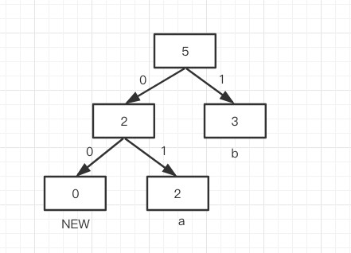

   加入b后，不满足从左到右，从上到下的升序兄弟性质，与最远的a节点交换。

   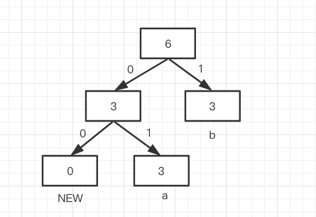

   加入a后，满足性质不交换节点，更新节点频率值。

   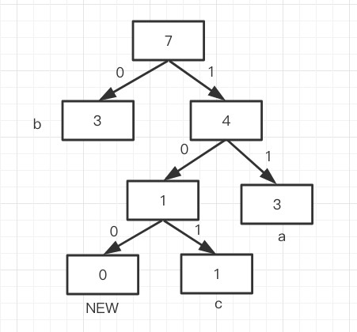

   将新加入的c和NEW作为原来NEW节点的子节点，然后向上更新节点频率值，发现4小于3，然后交换。

   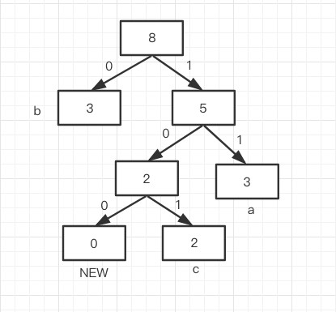

   最后加入c，满足性质不交换节点，只更新节点频率值。


## 第二题

### 1、理论原因分析

给出你做出选择的原因的解释，包括不同格式图像数据、不同格式图像的编码方法等对比。 


1. 第一次作业的中值切分算法适用于GIF压缩格式，使用调色板的8位索引作为像素点的值，但会导致色彩的丰富大大降低，适用于颜色不是很丰富，变化不大的图片，如此次作业中的卡通图片，失真度主要在于色彩数目的减少。

2. 同样是有损压缩的JPEG算法，保存了RGB三个颜色通道的值，只是根据人眼的三个特性对图像内容进行了量化，并根据熵编码减少了信息编码的平均长度，使其更接近信息熵的下界，对自然图像的视觉失真度较小，适用于此次的动物照片，失真度主要在于高频信息的丢失。

JPEG中的DCT变化主要是为了减少高频信息，色度二次采样主要是针对人类对灰度的敏感度大于彩色的敏感度。


### 2、程序实现

 JPEG 的压缩算法

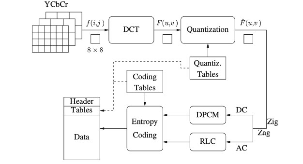

编码器：

1. 把RGB转换成YCbCr颜色模型，并进行二次采样
2. 对8x8的图像块进行二维DCT变换
3. 根据亮度量化表和色度量化表进行量化
4. 进行熵编码的准备：ZigZag编序并对DC进行DCPM编码，对AC进行游长编码
5. 哈夫曼熵编码成二进制流

解码器：

1. 由于编码采用无损方式，根据建立好的哈夫曼表进行解码

2. 对DC和AC进行解码，根据ZigZag还原成8x8的图像块

3. 反量化

4. 逆DCT变换

5. 转换成RGB颜色空间


**src/中的TestModule.ipynb负责测试各个模块的实现，pro2.ipynb负责jpeg压缩，具体见TestModule.html和pro2.html**


#### 编码器

 1. 首先将图像的长和高转换为8的整数倍，因为之后需要进行8x8的块编码。

    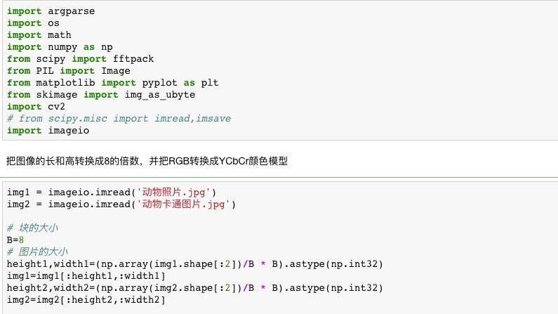

 2. 把RGB转换成YCbCr颜色模型

    > Y'为颜色的亮度(luma)成分、而CB和CR则为蓝色和红色的浓度偏移量成份。
    >
    > 使用YCbCr是因为人眼对亮度变换的敏感度要比对色彩变换的敏感度高出很多，所以可以对它的CbCr通道进行接下来的降采样。

    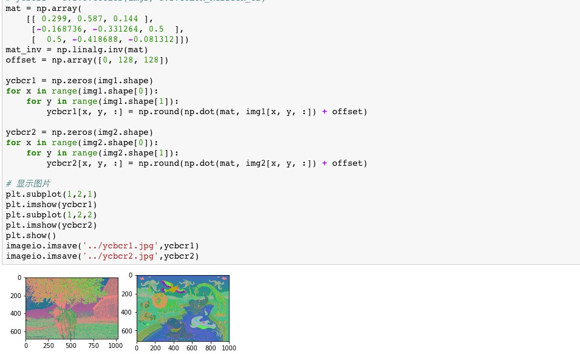

    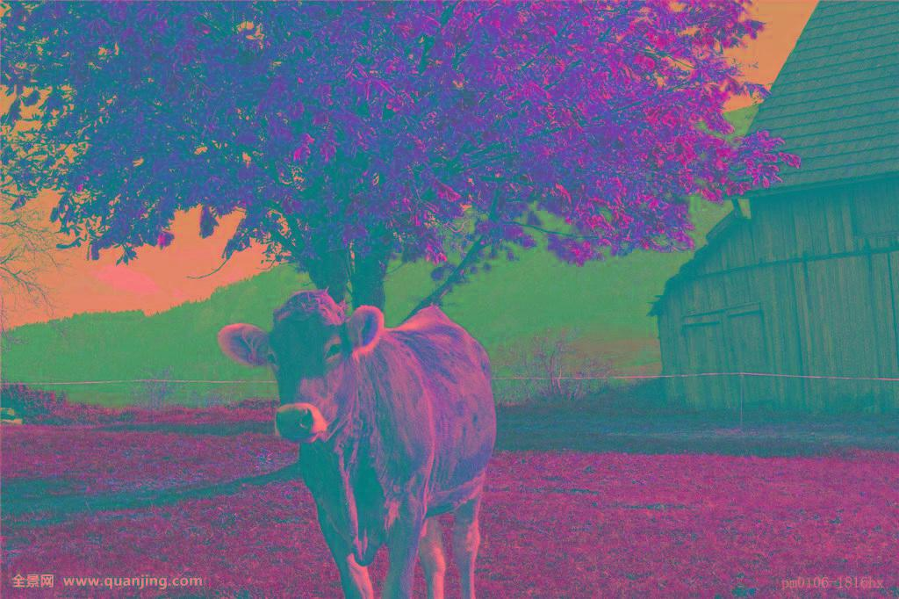

    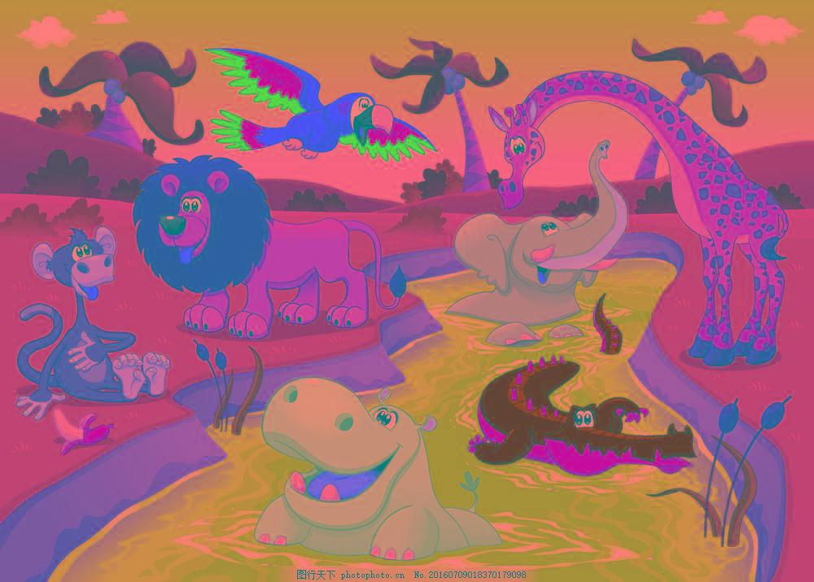


3. 按照4:2:0方式二次降采样

   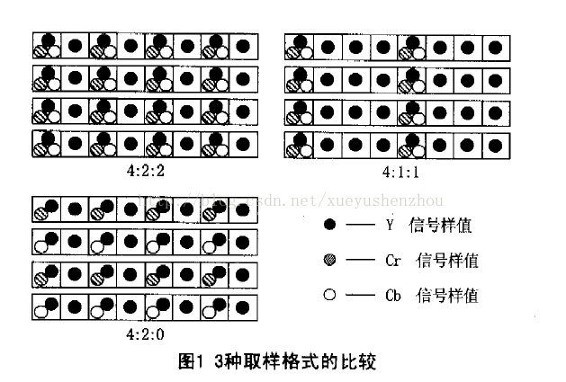

   > 使用2*2平滑滤波（取区域内的平均值）进行下采样。
   >

   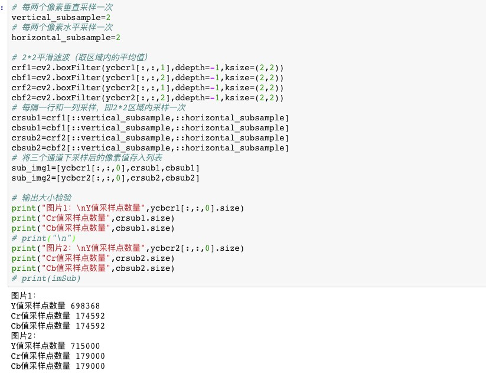

   通过计算发现Y通道采样点的个数为Cb和Cr通道的4倍


4. 对8x8的图像块进行二维DCT变换

   > DCT变换主要用于减少高频内容，比傅立叶变换好的地方就是基函数是实函数，可以利用两次一维DCT变换加速运算。


   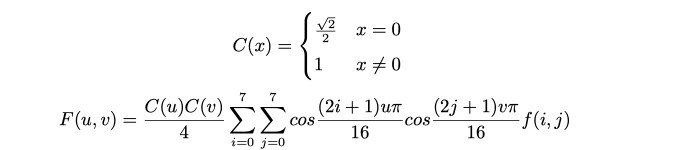


   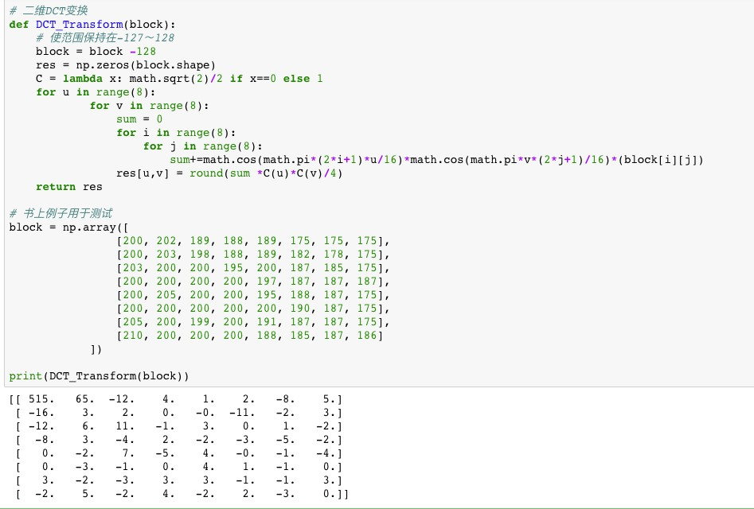


5. Y根据亮度量化表，Cb和Cr根据色度量化表进行量化

   > 有损变化，JPEG产生信息丢失的主要原因。

   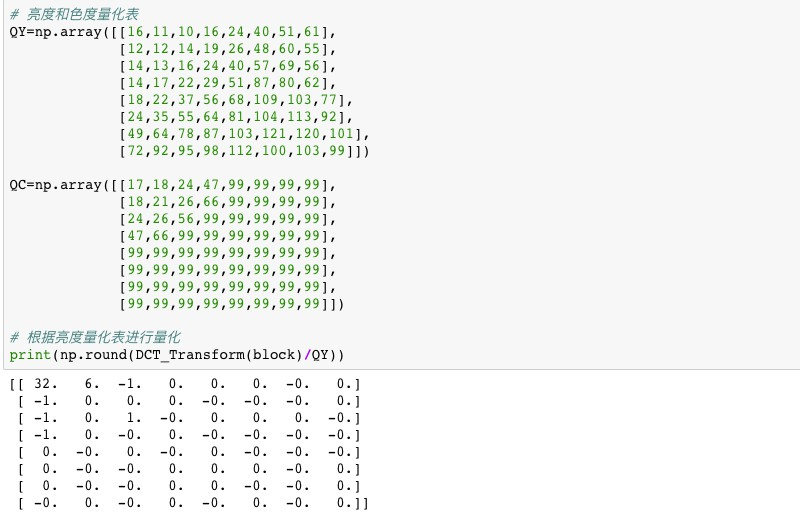


6. ZigZag编序扫描

   > 从低频内容向高频内容扫描，为RLC作准备。

   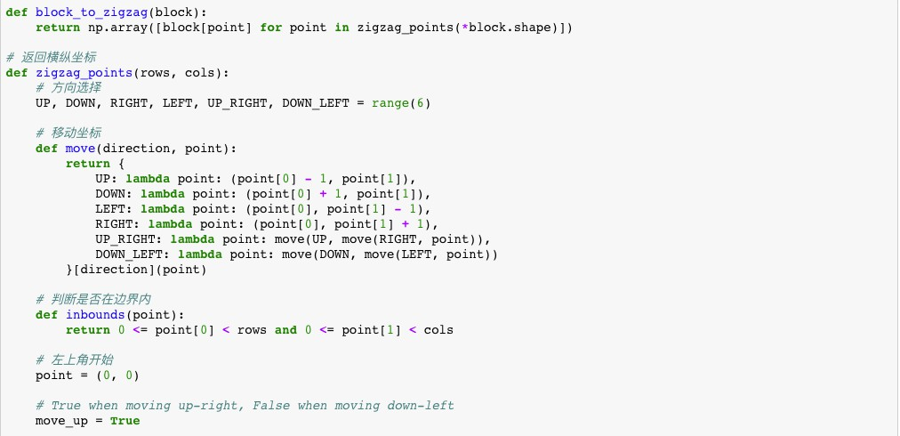

   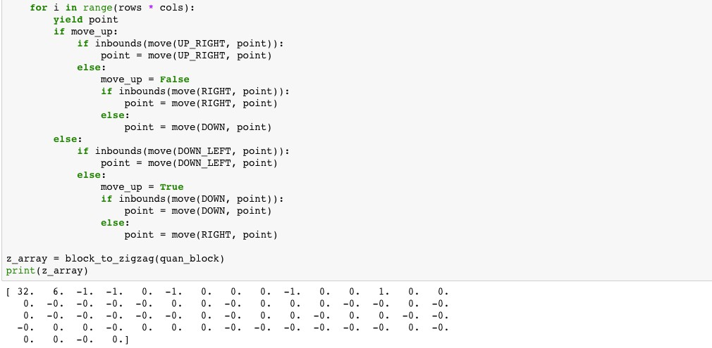


7. AC系数的RLC游长编码

   > symbol1: （runlength,size）
   >
   > Symbol2: （amplitude）

   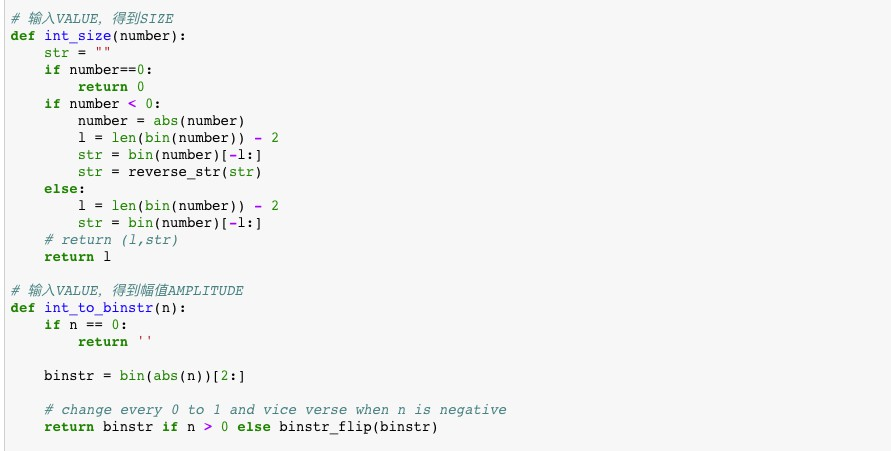

   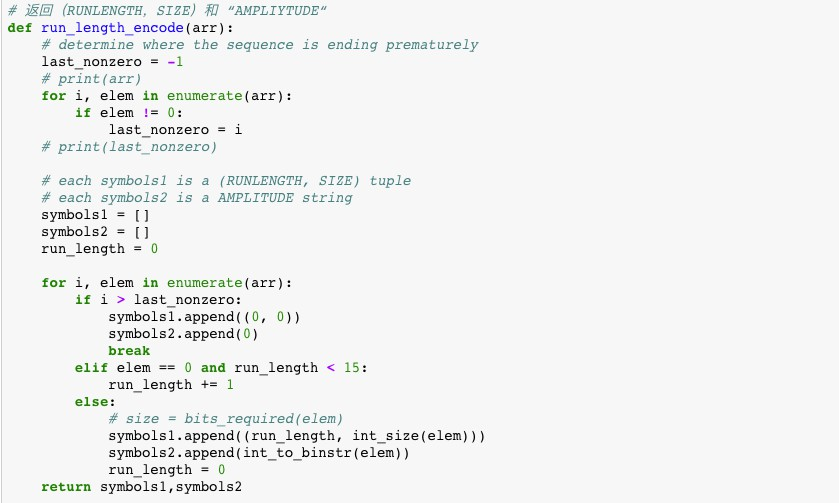

   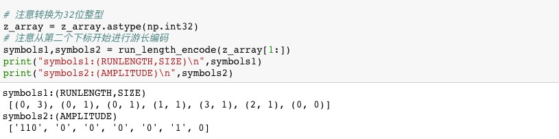

   注意如果VALUE为0，AMPLITUDE为0，而不是字符串‘0‘，因为它代表-1。


8. DC系数的DCPM编码

   > 根据DCT变换，每个块都会得到一个DC分量。对于每个颜色空间的DC分量，计算差值，使得过去的值可以用现在的值加上之前的累加和来表示。
   >
   > （size，amplitude）

   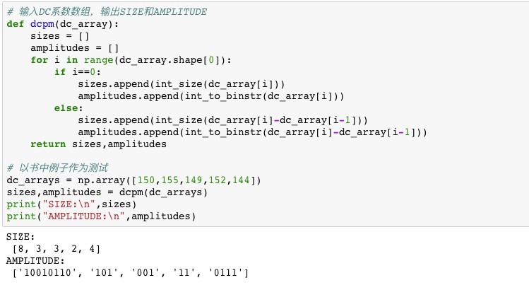


9. 哈夫曼熵编码

   建立四个哈夫曼树，两个用于Y通道的DC和AC编码，两个用于CbCr通道的DC和AC编码

   其中对于DC系数，对SIZE进行哈夫曼编码，对于AC系数，对Symbol1（RUNLENGTH，SIZE）元组进行哈夫曼编码

   具体实现见huffmantree.py，或TestModule.ipynb

   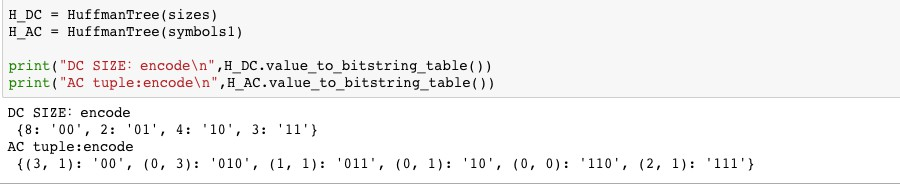


#### 解码器

1. 读取二进制文件并进行哈夫曼解码，然后根据存储的AMPLITUDE解码DC和AC系数并还原成z型数组（此处省略见decode.py）

2. 将z型数组还原成8x8的块

   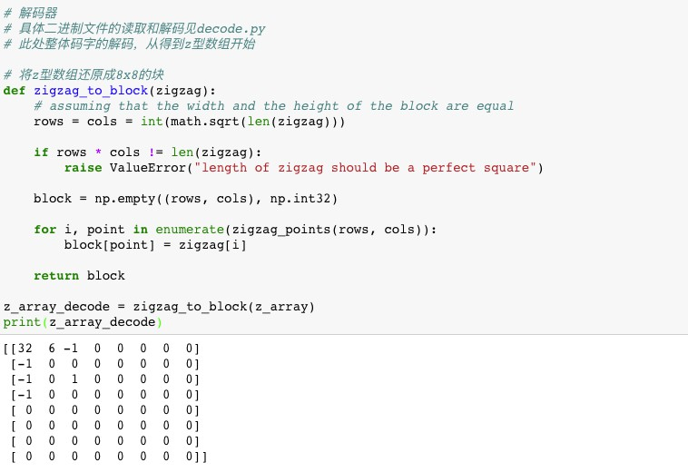

3. 逆量化

   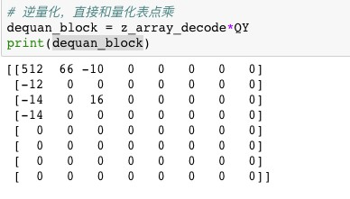

4. 逆DCT变换

   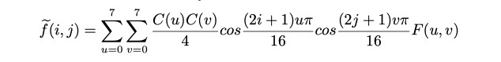

   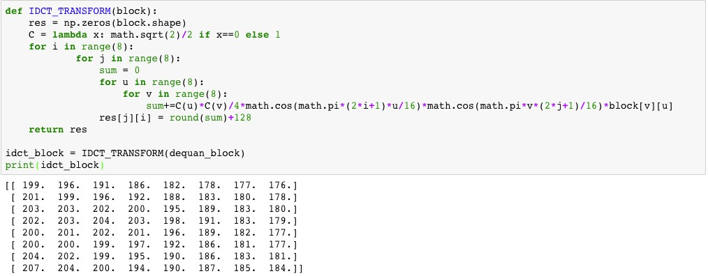

5. 得到重构误差

   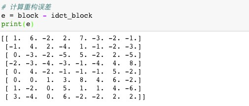


### 3、结果对比

JPEG 和 GIF 图像格式的视觉效果和压缩效果比较（包括压缩率的比较和失真度的比较，各占10%）。


#### 视觉效果

原始动物图像和动物卡通图像


**压缩后的图像**

具体见pro2中的

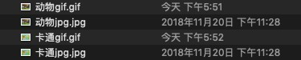


​	JPEG压缩并解码重构出来的图像（由于原图像的高度不为8的整数倍，故先进行padding后再进行压缩处理）


​								使用[在线网站](https://www.onlineconverter.com/jpg-to-gif)将jpg文件转换成gif文件


​	JPEG压缩并解码重构出来的图像（由于原图像的高度不为8的整数倍，故先进行padding后再进行压缩处理）


​							使用[在线网站](https://www.onlineconverter.com/jpg-to-gif)将jpg文件转换成gif文件


#### 压缩率

在写二进制文件的时候对写入的位数进行计算，或者使用UltraEdit查看十六进制格式。

1. 动物图片编码后的位数为**1329860**，由于原图片为经过压缩后的jpg文件，对其使用RGB真彩色位图的计算方式，得到总位数为**17,160,000**，压缩率为**0.077497669**。

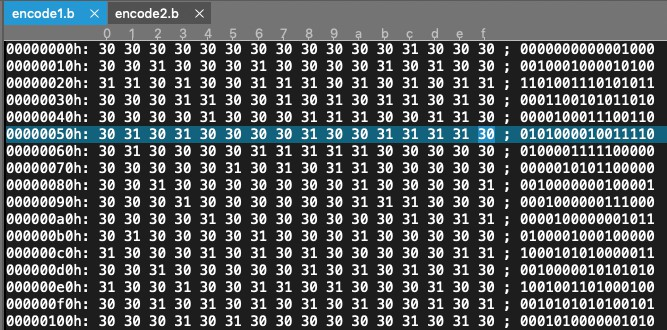

​	将jpg转换为gif的格式后的文件大小为**616KB**，压缩率为**0.2871794872**


2. 同理卡通图片原位数为**16,760,832**，编码后为**755615**，压缩率为**0.04508218924**

   动物卡通图片的gif大小为**417KB**，压缩率为**0.1990354655**


| 动物图像                   | jpeg压缩                  | gif          |
| -------------------------- | ------------------------- | ------------ |
| 17,160,000 bits （2.145MB) | 1329860 bits（166.2325KB) | 616KB        |
| 压缩率                     | 0.077497669               | 0.2871794872 |

| 动物卡通图像                | jpeg压缩                | **gif**      |
| --------------------------- | ----------------------- | ------------ |
| 16,760,832 bits （2.095MB） | 755615 bits（94.451KB） | 417KB        |
| 压缩率                      | 0.04508218924           | 0.1990354655 |


#### 失真度

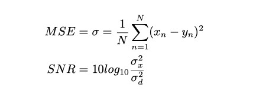

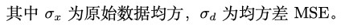

```python
# 失真度计算
# 适用于RGB图像，注意shape相同

# 均方差
def MSE(reCons,origin):
    res = 0
    for i in range(reCons.shape[0]):
        for j in range(reCons.shape[1]):
                res += sum((reCons[i,j] - origin[i,j]) ** 2)
    res = res / (reCons.shape[0]*reCons.shape[1])
    return res 

# 信噪比
def SNR(reCons,origin):
    res = 0;
    for i in range(origin.shape[0]):
        for j in range(origin.shape[1]):
                res += sum(origin[i,j]** 2)
    res = res / (origin.shape[0]*origin.shape[1])
    return 10*math.log(res**2/MSE(reCons, origin)**2,10)
```


| 动物图片 | JPEG              | GIF               |
| -------- | ----------------- | ----------------- |
| 均方差   | 141.428259886     | 131.650367714     |
| 信噪比   | 6.844158124101839 | 7.466440552682235 |


| 动物卡通图片 | JPEG              | GIF               |
| ------------ | ----------------- | ----------------- |
| 均方差       | 111.04381958      | 98.9218447552     |
| 信噪比       | 8.993319475662155 | 9.997363176949868 |

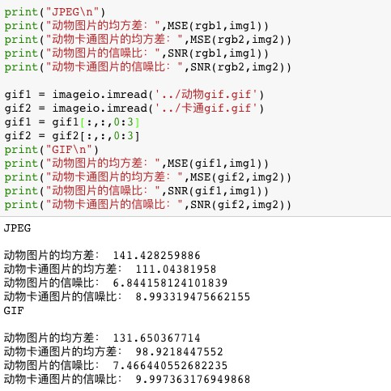


